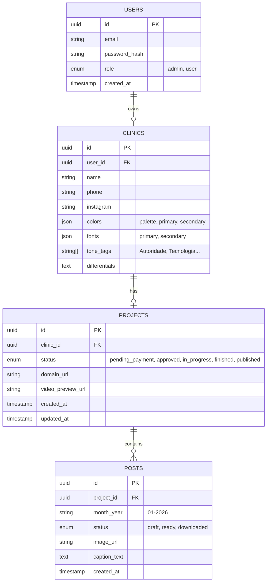

# Banco de Dados - Schema e Estrutura

**Tecnologia:** Neon (PostgreSQL Serverless)
**ORM:** Drizzle ORM (Type-safe)

## Diagrama de Entidade-Relacionamento (ERD)

## Detalhamento das Tabelas

### 1. `users` (Usuários)
Tabela central de autenticação.
*   `id`: UUIDv4 (Primary Key)
*   `email`: Email único (Login)
*   `role`: Define permissões. 'master' tem acesso ao painel admin global.

### 2. `clinics` (Dados da Clínica)
Armazena as informações coletadas no Quiz. Separado de `users` para permitir que um usuário (dono) possa ter múltiplas clínicas no futuro (escalabilidade), embora inicialmente seja 1:1.
*   Store de JSON para `colors` e `fonts` permite flexibilidade caso a estrutura do quiz mude sem precisar de migrations complexas.

### 3. `projects` (O Site)
Controla o estado do serviço principal (a criação do site).
*   `status`: Campo máquina de estados principal.
    *   `pending_payment`: Quiz feito, mas não pagou.
    *   `approved`: Pagou R$97.
    *   `in_progress`: Staff trabalhando.
    *   `finished`: Pronto para review (vídeo).
    *   `published`: No ar.

### 4. `posts` (Conteúdo Social)
Armazena a entrega mensal de conteúdo.
*   `month_year`: Identificador do lote (ex: "Fevereiro 2026").
*   `status`: Controla se o usuário pode ver/baixar.

## Estratégia de Conexão
*   Uso de **Connection Pooling** do Neon para evitar exaustão de conexões em ambiente Serverless (Vercel Functions abrem muitas conexões efêmeras).
*   **Drizzle Kit** para geração e execução de migrações (`drizzle-kit push` ou `generate`).

## Segurança (RLS - Row Level Security)
*   Embora o Drizzle faça as queries, "boas práticas" ditam que devemos sempre filtrar por `user_id` nas queries de backend para garantir isolamento de dados (Multi-tenancy lógico).
